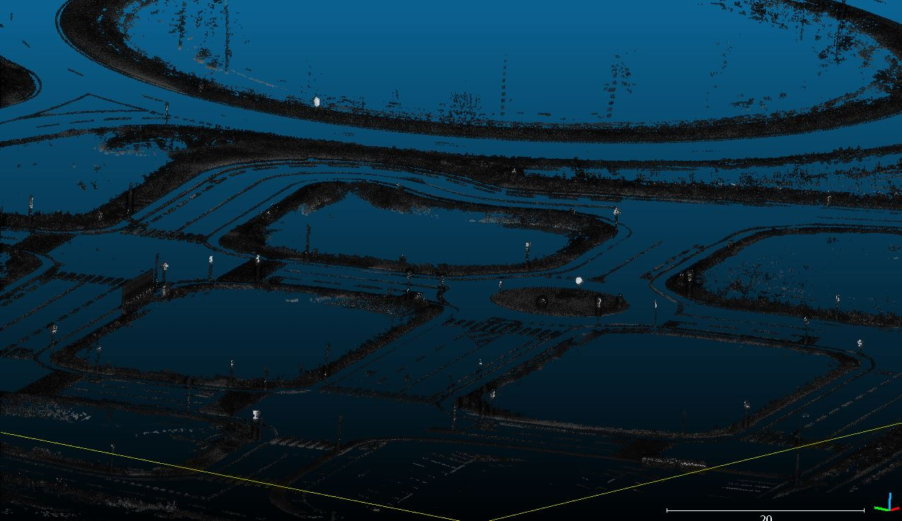
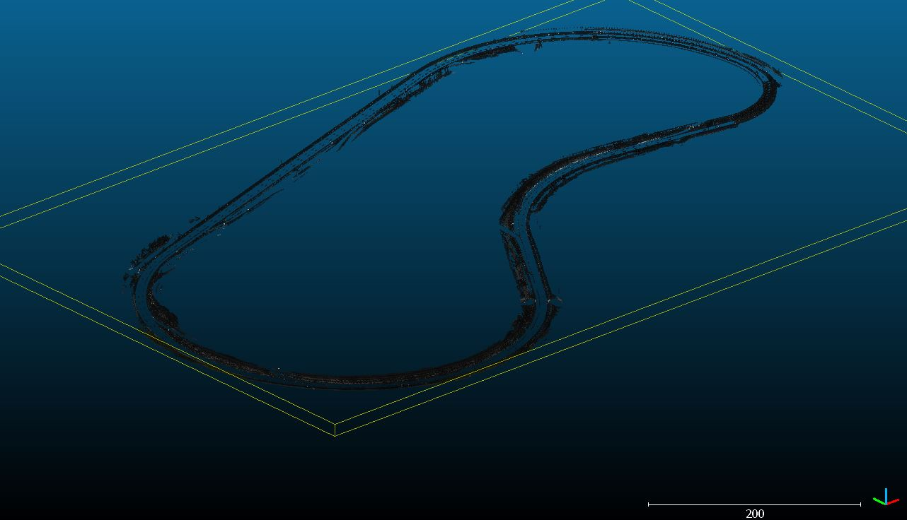

# Datasets
3d mapping done at the [utacceram](https://utacceram.com/fr/) by [ESIGELEC](http://www.esigelec.fr/).

Datasets were done on [TEQMO](https://utacceram.com/fr/teqmo) city and speedway roads :

## DATASET 2020/01/30 : 
Current datasets were done under the rain, so the quality of data is not fine, specially images.
Dataset file are saved in a format similar than Kitty file formats.

* City : Winter under rain (no lidar points on ground and camera under rain)
    * [pointCloud (Download)]()
    * [lidar_imu_carOdo(Download)]()
    * [images(Download)]()

    
    
    
    [maps preview](https://www.google.com/maps/d/embed?mid=1BzoEinkUFQNFpJhPhOhCdqq2DEIC9fSB)

* Speedway : Winter under rain (no lidar points on ground and camera under rain)
    * [pointCloud (Download)]()
    * [lidar_imu_carOdo(Download)]()
    * [images(Download)]()

    
    
    
    [maps preview](https://www.google.com/maps/d/embed?mid=1dPyuqs7s57i1r0VdSRBu_oFEdFZVfqdj)

## Files description : 
* map.xyz : data x, y, z, color R (0 to 255), color G(0 to 255), color B (0 to 255)
* mapOffset.csv : map offset utm Est,North,Up

## Calibrations (X forward, Y left, Z Up) :
* Transformation IMU to Lidar (Tx,Ty,Tz,Rx,Ry,Rz) : [0.989,-0.024, 2.388,0.0,0.0,-0.385]
* Car odometry and IMU have the same measurement points (rear axle)
* Transformation lidar to Camera (Tx,Ty,Tz,Rx,Ry,Rz) : [0.74,-0.43, 0.0,0.0,0.0,0.0]

## List of sensors and software used :
* vlp16 Lidar synchronised on GPS ([Velodyne](https://velodynelidar.com/))
* GPS AsterRx-U ([septentrio](https://www.septentrio.com/))
* LANDYN IMU + post processing software APPS ([IXblue](https://www.ixblue.com/))
* simple camera not synchronised by hardware
* Peiseler odometer mounted on the right rear wheel.
* RTMAPS ([Intempora](https://intempora.com/)) Realtime acquisition software (can also be used to replay datasets)
* Rtk correction network ([teria](https://www.reseau-teria.com/reseau/)) 
* PCAN-USB ([peak-system](https://www.peak-system.com)) 
